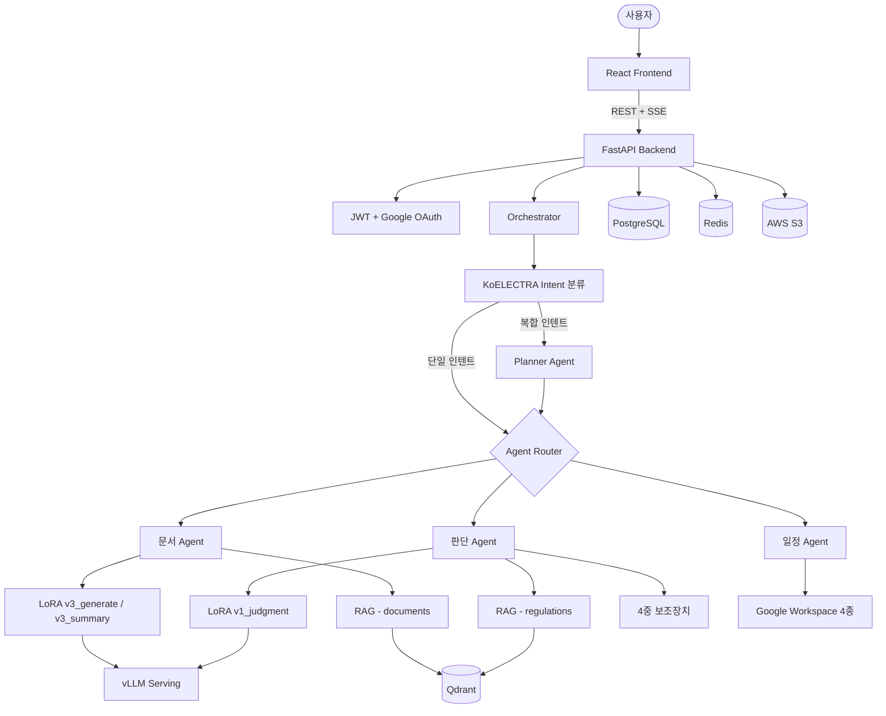
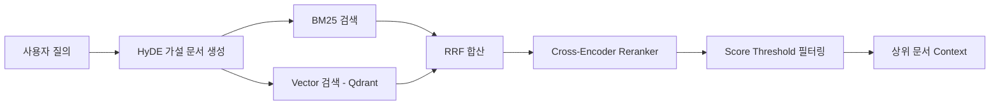

# DUDE — WorkFlow Agent

> **하나의 채팅으로 업무의 모든 것을**
>
> 사내 규정 / 문서 / 일정을 하나로 — Multi Agent 팀 워크스페이스

**SKN21 FINAL 3TEAM** | 멘토: 최민수 | 2026.03.31

---

## 목차

1. [프로젝트 개요](#1-프로젝트-개요)
2. [핵심 성과](#2-핵심-성과)
3. [시스템 아키텍처](#3-시스템-아키텍처)
4. [에이전트 상세](#4-에이전트-상세)
5. [데이터셋 및 파인튜닝](#5-데이터셋-및-파인튜닝)
6. [RAG 파이프라인](#6-rag-파이프라인)
7. [기술 스택](#7-기술-스택)
8. [프로젝트 구조](#8-프로젝트-구조)
9. [팀 구성](#9-팀-구성)
10. [빠른 시작](#10-빠른-시작)

---

## 1. 프로젝트 개요

### 배경

Microsoft Work Trend Index 2023에 따르면, 현대 직장인의 업무 환경에는 다음과 같은 문제가 존재합니다.

| 문제 | 비율 |
|------|------|
| 충분한 집중 시간 부족 | 68% |
| 과도한 정보 탐색 소요 | 62% |
| 커뮤니케이션 소모 비중 | 57% |

### DUDE가 해결하는 것

DUDE는 **3개의 전문 Agent + 1개의 Planner**로 구성된 Multi-Agent 시스템입니다. 사내 규정 확인, 문서 작성, 일정 관리를 하나의 채팅 인터페이스에서 자연어로 처리합니다.

### 4대 핵심 기능

| 기능 | 설명 |
|------|------|
| **AI 챗봇** | Multi-Agent 라우팅 + SSE 실시간 스트리밍 |
| **규정 판단 자동화** | sLLM + RAG + 4중 Guardrail |
| **문서 처리** | 템플릿 기반 자동 생성 + 검색 / 요약 / QA |
| **일정 및 결재 관리** | Google Workspace 4종 연동 |

### 기대 효과

| 업무 영역 | AS-IS | TO-BE |
|-----------|-------|-------|
| 규정 확인 | 수동 검색 10~15분 | 자연어 질의 10초 이내 |
| 문서 작성 | 수동 30분~1시간 | AI 자동 생성, 검토만 5분 |
| 일정 관리 | 3~4개 앱 수동 전환 | 채팅 한 줄로 등록/조회/알림 |
| 정보 탐색 | 여러 문서 직접 검색 | RAG 하이브리드 즉시 답변 |

---

## 2. 핵심 성과

| 항목 | 결과 |
|------|------|
| Intent 분류 (KoELECTRA) | Test F1 **97.88%**, Adversarial F1 **87.58%**, 추론 **7.9ms** |
| Google Workspace 연동 | Calendar + Tasks + Gmail + Meet **4종 완료** |
| Backend | **12 테이블** DB 설계 + JWT 인증 + SSE 실시간 스트리밍 |
| Frontend | **11 페이지** + 챗봇 카드 UI + FullCalendar 일정 연동 |
| LoRA 파인튜닝 | 판단(v1_judgment) + 문서생성(v3_generate) + 문서요약(v3_summary) + Planner(v7_planner) |
| RAG | Hybrid Search(BM25+Vector) + Cross-Encoder Reranker + HyDE 적용 완료 |

---

## 3. 시스템 아키텍처

### 전체 흐름



### Intent 분류 체계 (8개 + Planner)

```
judgment       — 규정 판단 요청
doc_search     — 문서 검색
doc_generate   — 문서 생성
doc_summary    — 문서 요약
doc_qa         — 문서 QA
schedule_add   — 일정 등록
schedule_view  — 일정 조회
general        — 일반 대화
+ Planner      — 복합 인텐트 분해 및 병렬 처리
```

---

## 4. 에이전트 상세

### 에이전트 비교 테이블

| 구분 | 문서 Agent | 판단 Agent | 일정 Agent | Planner |
|------|-----------|-----------|-----------|---------|
| **입력** | doc_retrieve, doc_generate | judgment (규정 질문) | schedule_add, schedule_view | 복합 요청 (멀티 인텐트) |
| **핵심 기술** | LoRA 라우팅 (v3_generate / v3_summary) | 4중 보조장치, 5-factor confidence | LLM+Regex 2-layer 파싱, Google 4종 | 템플릿 합성, depends_on 병렬 처리 |
| **RAG 사용** | 검색/QA만 (source=documents) | 항상 (source=regulations) | X | X |
| **sLLM / LoRA** | v3_generate, v3_summary, QA는 base | v1_judgment | Solar API (파싱용) | v7_planner |
| **출력 포맷** | JSON + DOCX, 카드/파일 | JSON (result / conf / reasoning) | JSON + Google event link | JSON (plan: steps) |
| **특징** | 검색은 LLM 호출 없음 (최고속) | LLM 판단을 맹신하지 않음 (다중 검증) | 멀티스텝 인터랙션 (되물어보기) | 최대 4단계 의존성 관리 |

---

### 4-1. 문서 Agent

4가지 오퍼레이션으로 구성되며, LoRA 어댑터로 라우팅합니다.

**doc_retrieve (3-way 분기)**

```
사용자 질의 → 서브타입 판단 (Regex + RAG score) → search / QA / summary
```

- `search`: RAG only, LLM 호출 없이 검색 결과 반환 (최고속)
- `QA`: RAG 검색 후 base LoRA로 답변 생성
- `summary`: RAG 검색 후 v3_summary LoRA로 요약 생성

**doc_generate (4단계)**

```
템플릿 선택 → 내용 확인 → sLLM 생성 (v3_generate LoRA) → DOCX 파일 생성
```

지원 템플릿: 회의록, 보고서, 제안서, JD 등

---

### 4-2. 판단 Agent

규정 기반 yes/no/conditional 판단을 수행하며, LLM 결과를 **맹신하지 않는** 다중 검증 구조입니다.

**6단계 처리 파이프라인**

```
RAG 검색 → 규정 그룹핑 → 이전 판단 이력 참조 → sLLM 판단 (v1_judgment LoRA)
→ 4중 보조장치 검증 → Confidence 보정
```

**4중 보조장치 (Guardrail)**

| 장치 | 역할 |
|------|------|
| 규정 키워드 매칭 | 판단 근거가 실제 규정 키워드와 일치하는지 검증 |
| 조항 존재 검증 | 인용된 조항이 실제 존재하는지 확인 |
| 판단 카테고리 제한 | 허용된 카테고리(yes/no/conditional) 외 응답 차단 |
| 일관성 모니터링 | 동일 질의 유형에 대한 판단 일관성 추적 |

**5-factor Confidence 산출**

```
Confidence = (LLM raw x 0.60) + (RAG avg x 0.25) + (규정 커버리지 x 0.15)
             - 충돌 감점 - 환각 감점 - 미존재 감점
```

---

### 4-3. 일정 Agent

자연어를 일정 데이터로 변환하고, Google Workspace 4종과 연동합니다.

**schedule_add**

```
LLM 자연어 파싱 → Fallback 파싱 → 누락 정보 체크 → Google Calendar 등록 → 후속 제안
```

**schedule_followup**: Meet 생성, 메일 발송, 되물어보기 응답

**schedule_view**: 기간 파싱 → DB 조회 → 시간대별 목록 반환

**Google Workspace 연동 4종**: Calendar, Meet, Gmail, Tasks

---

### 4-4. Planner Agent

3개 Agent를 하나의 LangGraph 오케스트레이터로 융합합니다.

```
복합 질의 → Intent 분해 → depends_on 기반 병렬 라우팅 → 개별 Agent 실행 → 응답 통합
```

- 최대 4단계 의존성 관리
- v7_planner LoRA 파인튜닝
- 멀티 인텐트 요청을 단계별 plan으로 분해하여 순차/병렬 실행

---

## 5. 데이터셋 및 파인튜닝

### 데이터 구성 총괄

| 구분 | Train | Eval | 출처 |
|------|-------|------|------|
| Intent 분류 | 3,954 | 610 | 자체 제작 + Adversarial 463 |
| Planner | 1,471 | 150 | 자체 제작 + GPT 증강 |
| 판단 LoRA | 3,468 | 328 | 수동 제작(Excel) + RAG 증강 |
| 문서 요약 | 900 | 100 | AI Hub SN 582 + GPT 증강 |
| 문서 생성 | 1,350 | 150 | AI Hub + 합성(회의록/보고서/제안서) |

### 데이터 수집 전략 (2-Track)

**Track 1 — 수동 제작 (고품질)**

| 데이터 | 수량 |
|--------|------|
| 규정 판단 쌍 | 1,000 |
| 규정 QA 쌍 | 1,000 |
| Intent 분류 | 1,453 |
| Adversarial | 463 |
| 복합 질문 | 780 |

**Track 2 — AI Hub + 합성 (대량)**

- AI Hub SN 582, SN 569 활용
- GPT-4o 빈 필드 증강
- 합성 회의록 / 보고서 / 제안서
- 최대 50% 합성 비율 유지 (품질 관리)

### 파인튜닝 모델

| 모델 | Base | 용도 |
|------|------|------|
| v1_judgment | Kanana-1.5-8B | 규정 판단 (yes/no/conditional + 근거 + 대안) |
| v3_generate | Kanana-1.5-8B | 문서 생성 (회의록, 보고서, 제안서) |
| v3_summary | Kanana-1.5-8B | 문서 요약 |
| v7_planner | Kanana-1.5-8B | 복합 인텐트 분해 및 plan 생성 |
| KoELECTRA | KoELECTRA-base | Intent 멀티라벨 분류 (8클래스) |

---

## 6. RAG 파이프라인



| 구성 요소 | 기술 |
|-----------|------|
| Embedding | jhgan/ko-sbert-nli (768d) |
| Vector DB | Qdrant |
| Sparse Search | BM25 |
| 합산 | RRF (Reciprocal Rank Fusion) |
| Reranker | bge-reranker-v2-m3 (Cross-Encoder) |
| Query 확장 | HyDE (Hypothetical Document Embeddings) |
| 후처리 | Score Threshold 기반 필터링 |

---

## 7. 기술 스택

### AI / ML

| 기술 | 용도 |
|------|------|
| LangGraph | Agent 오케스트레이션 |
| Kanana-1.5-8B + LoRA | sLLM 파인튜닝 (판단/문서/Planner) |
| vLLM | 모델 서빙 |
| Qdrant | 벡터 DB |
| BM25 | 희소 검색 |
| bge-reranker-v2-m3 | Cross-Encoder Reranker |
| KoELECTRA | Intent 분류 |
| Docling + PaddleOCR | 문서 파싱 |
| jhgan/ko-sbert-nli | 임베딩 (768d) |

### Backend

| 기술 | 용도 |
|------|------|
| FastAPI + SSE | API 서버 + 실시간 스트리밍 |
| PostgreSQL | 메인 DB (12 테이블) |
| SQLAlchemy + Alembic | ORM + 마이그레이션 |
| JWT + Google OAuth 2.0 | 인증 |
| Redis | 캐시 / 세션 |
| AES-256 | 데이터 암호화 |

### Frontend

| 기술 | 용도 |
|------|------|
| React 18 (Vite) | UI 프레임워크 |
| Zustand + TanStack Query | 상태 관리 + 데이터 페칭 |
| Tailwind CSS + Lucide Icons | 스타일링 |
| FullCalendar | 일정 캘린더 UI |
| framer-motion | 애니메이션 |

### Infra

| 기술 | 용도 |
|------|------|
| AWS EC2 + S3 + RDS | 클라우드 인프라 |
| RunPod (A100 40GB) | GPU 서빙 |
| Docker | 컨테이너화 |
| GitHub Actions | CI/CD |

---

## 8. 프로젝트 구조

```
backend/app/              — FastAPI 백엔드
  api/v1/                 — REST API
  models/                 — ORM 모델 (12개 테이블)
  services/               — 비즈니스 로직 (Google Services 포함)
  schemas/                — Pydantic 스키마

ai/                       — AI/ML 모듈
  agents/                 — LangGraph Agent (orchestrator, judgment, document, schedule)
  llm/                    — LLM 공통 모듈 (factory, providers, prompts)
  rag/                    — RAG 파이프라인 (hybrid_search, reranker, qdrant)
  templates/              — 문서 템플릿 (회의록, 보고서, JD, 제안서)
  document_parser/        — 문서 파싱 (Docling, PaddleOCR, DOCX)
  finetuning/             — LoRA 학습
  serving/                — vLLM 클라이언트

frontend/src/             — React 프론트엔드
  components/             — UI 컴포넌트
  pages/                  — 11개 페이지
  store/                  — Zustand
  hooks/                  — useAuth, useSSE, useChat, useGoogleServices
```

---

## 9. 팀 구성

| 이름 | 역할 | 담당 |
|------|------|------|
| **신지용** | PM | 프로젝트 관리, 의도 분류, 오케스트레이터, 문서 Agent |
| **문지영** | FE / AI | React UI, SSE 실시간 채팅, Intent 멀티라벨 분류, Planner LoRA 파인튜닝 |
| **안혜빈** | BE | FastAPI, DB, 인증, Google API 연동, 멀티 Agent 기능 강화 |
| **윤경은** | AI | 판단 Agent, RAG, LoRA 파인튜닝, 팀스페이스 기능 |

---

## 10. 빠른 시작

### Backend

```bash
cd backend
pip install -r requirements.txt
uvicorn app.main:app --reload
```

### Frontend

```bash
cd frontend
npm install
npm run dev
```

### 환경 변수

Backend와 Frontend 각각의 `.env` 파일을 구성해야 합니다. `.env.example` 파일을 참고하여 설정하십시오.

---

> **DUDE** — 하나의 채팅으로 업무의 모든 것을
